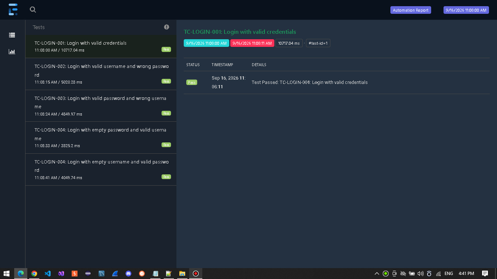

# 🖥️ Project 9 – Invetory-App Desktop UI Testing Automation Framework


> **Note:** This project is part of my personal QA Automation portfolio.

> **Note:** Some reusable framework components are maintained in a private utility library and are intentionally excluded from this public repository.

## Table of Contents

- [Overview](#overview)
- [Tech Stack](#tech-stack)
- [Framework Features](#framework-features)
- [Framework Architecture](#framework-architecture)
- [Test Execution](#test-execution)
- [Reports](#reports-and-logging)
- [Conclusion](#conclusion)


## 📖 Overview

This project is a Desktop UI Automation Framework built with C#, NUnit, Appium, Selenium WinAppDriver, and Extent Reports.
The framework is designed to automate key workflows of the Inventory DesktopApplication, including:
- Authentication
- Customer Management
- Product Management


## 🎥 Demo

A short demonstration of the Inventory Desktop UI Automation Framework in action. <br>

<a href="https://dorusqa.github.io/assets/appium-demo.mp4">
  ▶️ Watch Demo
</a>

---

<a id="tech-stack"></a> 
## 🛠️ Tech Stack 
 
| Technology | Purpose |
|------------|---------|
| C# | Programming language |
| .NET 6.0 | Application framework |
| Appium | Automation framework and WebDriver client/server communication |
| Selenium WebDriver | WebDriver-based automation API |
| WinAppDriver | Windows desktop UI automation driver |
| NUnit | Test execution, test organization, and assertions |
| Extent Reports | HTML test execution reporting |
| JSON | External test data storage |


## ✨ Framework Features

- Windows Desktop UI automation using Appium and WinAppDriver
- Test suite selection
- Extent Reports for test execution results
- Separation of test logic, test data, and framework utilities
- Test execution control through NUnit parameters
- Element Waits
- Feature-based test organization

<a id="framework-architecture"></a>
## 🏗️ Framework Architecture

The framework is organized into dedicated layers, each with a clear responsibility to improve
maintainability, reusability, and separation of concerns.

| Component | Purpose |
|-------------------|---------|
| Base | Provides common setup and reusable functionality for all tests |
| Screen | Encapsulates screen specific elements and user interactions |
| Test Data | Generates and provides reusable test data objects |
| Expected | Centralizes expected values used during test execution |
| Tests | Contains test cases organized by application feature |
| Utils | Provides shared utilities for reporting, data reading, and custom element waits |


## ▶️ Test Execution

This framework supports configurable test execution through NUnit parameters.

### Test Suite Selection

#### Smoke Suite

```bash
dotnet test --filter "TestCategory=Smoke"
```
- Executes all the tests with 'Smoke' tag

#### Regression Suite

```bash
dotnet test --filter "TestCategory=Regression"
```
- Executes all the tests with 'Regression' tag

---

## Reports 

Test execution reports are generated using Extent Reports and located in the `Reports/` directory.

<details>
<summary>📊 <strong>Report Preview</strong></summary>

<br>



</details>


## 🎯 Conclusion

The main focus of this project was to demonstrate a practical approach to Windows Desktop UI Automation using Appium and WinAppDriver.

**Author:** [DoruSQA](https://github.com/DoruSQA) | [LinkedIn](https://www.linkedin.com/in/sava-doru/)